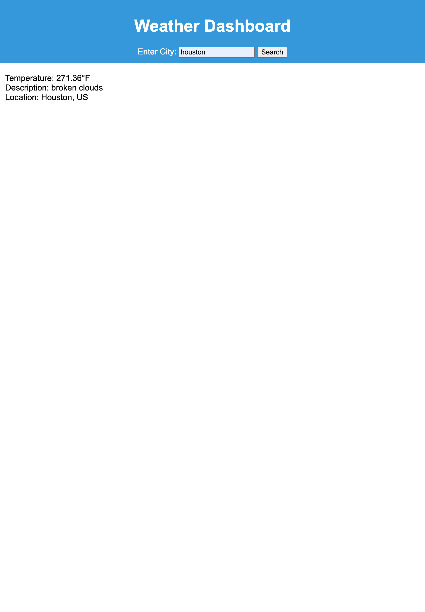

# special-rotary-phone-module6
Server-Side APIs Challenge: Weather Dashboard

## Description
The weather app can get data of the desired city. Type desired city in the search bar and get the temperature, description, and the location of city.
I used APIs from OpenWeather to get live city weatherData

### Screenshot off Weather APP:

### Live Link to Weather APP:
https://vjacobo.github.io/special-rotary-phone-module6/

### Credits
Build A Weather App in HTML CSS and JavaScript | Weather App Project HTML CSS and JavaScript
https://www.youtube.com/watch?v=SeXg3AX82ig

How To Make Weather App Using JavaScript Step By Step Explained
https://www.youtube.com/watch?v=MIYQR-Ybrn4

OpenWeather
https://openweathermap.org

#### License
MIT License
